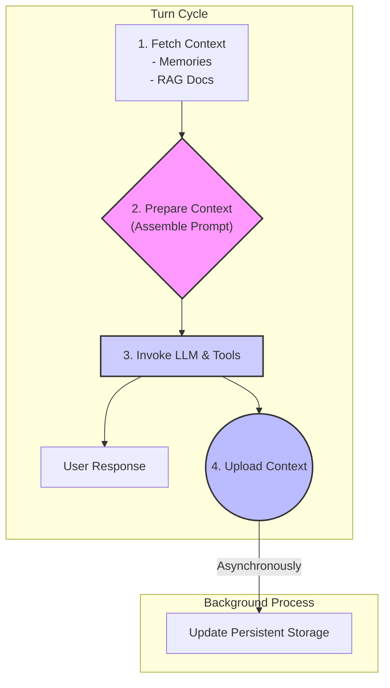
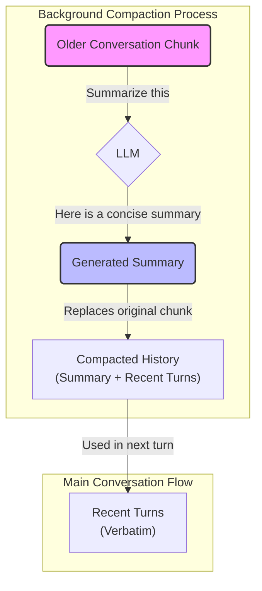
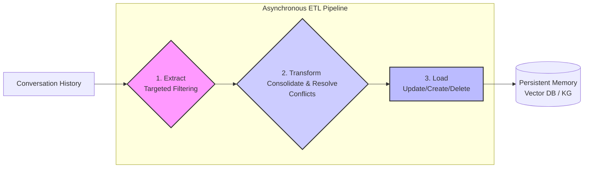
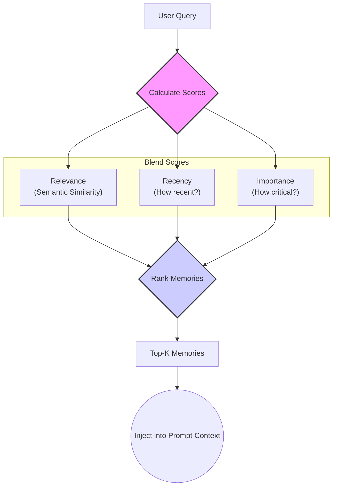

# The Blueprint for AI Memory: Deconstructing Context, Sessions, and Memory

Large Language Models (LLMs) possess an incredible ability to process and generate human-like text, yet they suffer from a fundamental weakness: they are inherently stateless. Each interaction is a blank slate, with no memory of previous turns. To build agents that can remember, learn, and offer truly personalized experiences, we must engineer a working brain for them.

Drawing from the principles outlined in the Google X Kaggle AI agents course, this article decodes the architecture required to transform a basic LLM into a stateful, persistent, and genuinely intelligent system. This architecture rests on three interconnected pillars: **Context Engineering**, **Sessions**, and **Memory**.

### Part 1: Context Engineering - The Foundation of State

Context engineering is the master controller that tackles the Achilles' heel of LLMs. It is the discipline of dynamically assembling and managing the perfect package of information within the LLM's context window for every single interaction.

This goes far beyond traditional prompt engineering. While prompt engineering is like giving a chef a recipe, context engineering is like setting up their entire *mise en place*. It ensures the chef has all the right ingredients (relevant data), the right tools (function definitions), and knowledge of your dietary needs (user memory), all perfectly prepped for the specific moment.

A context engineer must manage three types of data:
1.  **Operational Data:** System instructions, tool definitions, and few-shot examples that guide the model's reasoning.
2.  **External Data:** Information pulled from long-term memory, documents fetched via Retrieval-Augmented Generation (RAG) from a knowledge base, and the outputs from recently used tools.
3.  **Conversational Data:** The immediate turn-by-turn dialogue, temporary scratchpad information, and the user's latest message.

A primary challenge is **Context Rot**, where the context window becomes too full and noisy, degrading the model's ability to reason. Context engineering fights this with **dynamic history mutation**—smart strategies like summarization and selective pruning to trim the conversational fat and keep the signal strong.

This process follows a constant four-step cycle for every turn, with the final step running asynchronously to ensure a responsive user experience.

### Part 2: Sessions - The Conversational Workbench

If long-term memory is the organized filing cabinet, the session is the messy workbench for the current project. A session is a self-contained container for a single, continuous conversation with a specific user. It typically consists of two parts:
*   **Events:** A strict, chronological log of the conversation (e.g., "User says X," "Agent calls tool Z").
*   **State:** A structured working memory, like items in a shopping cart or the current step in a booking process.

In a production environment, session management has critical implications. Strict data isolation, PII reduction before storage, and TTL policies are essential.

Because session data is on the hot path, performance is paramount. To prevent latency from a bloated history, compaction is essential. A sophisticated method is **recursive summarization**, where the LLM itself periodically summarizes older parts of the conversation. This process is computationally heavy and **must be executed asynchronously**.

### Part 3: Memory - The Long-Term Filing Cabinet

While a session is temporary, memory provides long-term persistence and personalization. It's crucial to distinguish memory from RAG.

> RAG is the research librarian, making the agent knowledgeable about the world with static facts. Memory is the personal assistant, making the agent knowledgeable about *you* with dynamic, user-specific information.

Memory can be categorized similarly to human memory:
*   **Declarative Memory (The "Knowing What"):** Facts, events, and figures.
*   **Procedural Memory (The "Knowing How"):** Skills and workflows.

This information is stored using a hybrid of **vector databases** for semantic search ("find memories *about* X") and **knowledge graphs** for relational insights ("how is X *related to* Y and Z?").

The creation of memory is a sophisticated, **LLM-driven ETL (Extract, Transform, Load) pipeline** that must run asynchronously.

### Part 4: Activating and Testing Memory

Once memories are stored, they must be retrieved and used effectively. A more autonomous approach is to treat **memory as a tool**, giving the agent functions like `create_memory` and `query_memory`.

Effective retrieval requires moving beyond simple vector similarity. The best approach is a **blended score** that considers multiple factors to find the most useful context.

Retrieval can be **proactive** (fetching memories at the start of every turn) or **reactive** (the agent decides when to query memory during its reasoning). Finally, the placement of retrieved memories in the prompt is critical, as it signals their authority to the model.

Testing this entire system requires rigor, focusing on metrics for generation (precision/recall), retrieval (recall@k), latency, and the ultimate measure: **end-to-end task success**.

### Conclusion: The Path to Personalized AI

Mastering the interplay between context engineering, short-term sessions, and long-term memory is how we graduate from agents that merely know facts to agents that truly know *you*. This architecture provides the blueprint for shifting from simple factual recall to genuine personalized assistance, laying the foundation for adaptive AI experiences that learn and grow alongside their users. The framework is clear; the only remaining question is: what personalized, persistent experience will you build first?
